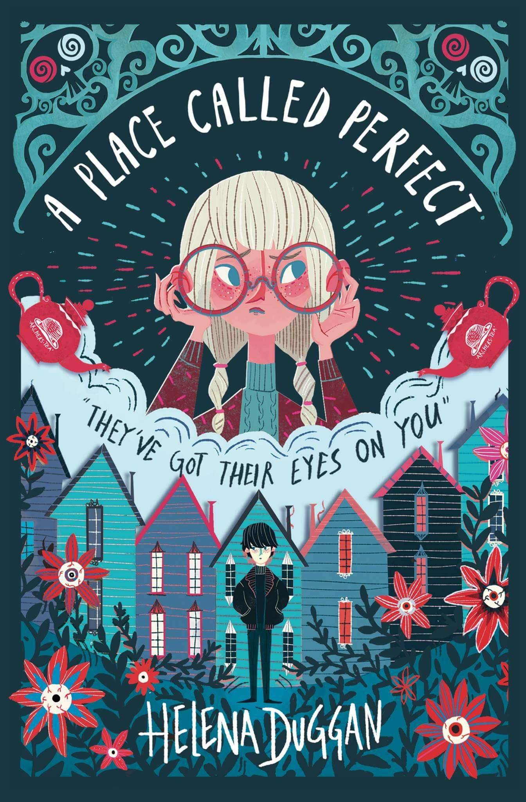

<h2>HTML Starting Point</h2>

I think its best to open a new doc and cut code from my example and re paste it into the new doc. As there are things that over lap or I have added that can just be a bonus for the end of class - or if there is time.

- Starting with a very simple structure, to explain around how HTML files are built (head / body / ...) then I find the best way to start my projects is to just lay out my initial content the page will have.

<!-- 

  

  

  

 -->

Then for each section I add different bits, title, text - can explain along the way divs, h1 - h5 header tags / p tags /  ...
Tried to keep this quite minimal so theres time to go through and mess with CSS

GALLERY - this gets a bit tricky. I would start just by adding a div with one img.

<!-- 

 -->

The img will be massive, and you can explain show some in-line styling which is a good way into get playing with CSS!

<h2>CSS</h2>

I would leave the image out for now - maybe comment it out and go back to the beginning and restyle the header and go down again from there.

To ignore til the end > fonts (taken from google fonts) / background-image: linear gradients to look like a note book. I would definitely explain using background images / different colours and getting nice fonts if there is time but what I have done are extras I put in to talk about at the end of the class along with refs so if the students are keen they can go and personalise their blog pages. Or if everything goes super quick you can add these.

It does mean some of the styling will look a bit off because these are not all in place but I'm sure you can work around it.

<h2>IMG GALLERY</h2>

I have done this using CSS grid - because its super straight fwd and quite nice tool to build a gallery with.

For the first round of creating the gallery just add the images all like this >

<!-- 

 -->

and then when you add the class names to highlight that with Grid you can change the size and positioning of the images so they look a bit funkier.

I have only changed the grid layout for a couple of the images just to give a general idea of what you can do.

HOVER OVER IMG > I didn't have time to do alllll the images like this but as an example I did one, I thought it would be nice if you hover over the img and then theres a link to click onto the review of that book >  thats when you can add all the 'book-review' class, explain links > build the second HTML page - or even send the link to amazon to buy the book...

<!-- 

  
  

    
Read my review<a href="book-review.html">here!</a>

  

 -->

even if all you build from the 2nd page is the back link to take you back to the home page thats cool. Note the styling for the 2nd page is using Flex -  just because using grid would be a bit silly.

The last box of the img gallery I thought would be nice to have a contact block - but feel free to have it separately under the gallery but It looks like as part of it and moves dynamically with it.

If you want you can expand on this by showing that you can have text blocks within your gallery (doesn't have to be at the end!) if you want to write inspirational quotes or something...

<h2>REFERENCES</h2>

All images taken from google img search

FONTS > https://fonts.google.com/
STAR Ratings > https://www.w3schools.com/charsets/ref_utf_symbols.asp
Notebook background > http://lea.verou.me/css3patterns/
CSS Grid Cheat sheet > http://grid.malven.co/
